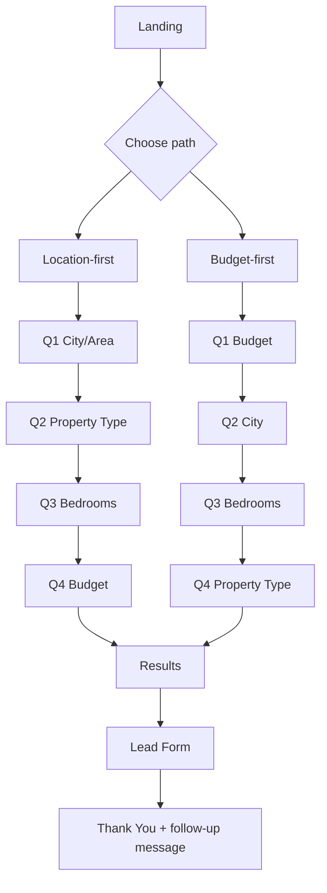
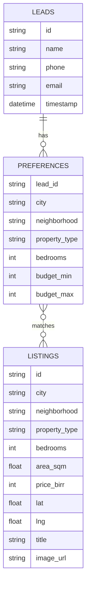

# Ethiopian Home Buyer Lead-Gen SPA — Project Specification

## 1) Project Overview (First-Person)
I am building a **mobile-first, static single-page app** (SPA) for Ethiopian home buyers, hosted on **GitHub Pages**. My goal is to guide users through a short multi-step questionnaire, generate an estimated price range and sample listings, then capture the lead with explicit consent.

I will implement this as a **Next.js static export** (or equivalent React static build) so there is no required custom server runtime on deployment.

---

## 2) Product Goals
1. I collect key buying preferences quickly:
   - City / area
   - Property type
   - Bedrooms
   - Budget
2. I provide instant value:
   - Estimated price range (`Br X–Y`)
   - Average price per m² (`Br Z/m²`)
   - 2–3 matching sample listings
3. I capture contact details for follow-up deals:
   - Name, Phone, optional Email, consent checkbox
4. I keep all UX friendly and concise.

---

## 3) Target Users & Context
- Primary audience: Ethiopian home buyers, especially first-time digital searchers.
- Primary device: Mobile.
- Language tone: Friendly, direct, low-friction.

Example hero/headline copy:
- **“Find your ideal home in Addis in minutes.”**

---

## 4) User Flows (Two Entry Paths)
I support two start paths, both converging to the same Results page.

### A) Location-first Flow
1. Q1: City/Area
2. Q2: Property Type
3. Q3: Bedrooms
4. Q4: Budget
5. Results page
6. Lead form

### B) Budget-first Flow
1. Q1: Budget
2. Q2: City
3. Q3: Bedrooms
4. Q4: Property Type
5. Results page
6. Lead form

### Step UX Rules
- Each question is on its own screen.
- `Next` and `Back` buttons shown on each step.
- `Next` disabled until current step is valid.
- Preserve prior answers while navigating back.
- Keyboard-friendly inputs and submit via Enter on text fields.

### Mermaid — User Flow


---

## 5) Information Architecture / Pages
Because this is a SPA, these are route-like views:

1. `/` — Landing + path selection.
2. `/flow/*` — Multi-step questionnaire (single component with internal step state).
3. `/results` — Estimate + listings + map + CTA.
4. `/lead` — Lead capture form.
5. `/thank-you` — Confirmation.
6. `/privacy` — Privacy policy (required for consent transparency).

---

## 6) Component-Level Specification

### Core Components
1. `AppShell`
   - Header, progress indicator, content area, footer links.
2. `PathSelector`
   - Buttons for Location-first / Budget-first.
3. `StepQuestion`
   - Reusable wrapper for each question screen.
4. `QuestionInput*`
   - `CitySelect`, `NeighborhoodSelect`, `PropertyTypeSelect`, `BedroomsSelect`, `BudgetInput`.
5. `StepperNav`
   - Back/Next controls with validation.
6. `ResultsSummary`
   - Criteria recap + estimate + avg price/m².
7. `ListingCard`
   - Image, title, price, beds, area.
8. `ListingsGrid`
   - 2–3 cards + “X homes found”.
9. `MapPanel`
   - Leaflet map with fallback placeholder.
10. `LeadForm`
   - Name/Phone/Email/Consent + submit CTA.
11. `ConsentNotice`
   - PDPP-compliant text and privacy link.

### State Shape (Client)
```ts
type SearchState = {
  flowType: 'location_first' | 'budget_first';
  city: string;
  neighborhood?: string;
  propertyType: 'apartment' | 'villa' | 'condo' | 'house';
  bedrooms: number;
  budgetMin?: number;
  budgetMax?: number;
};

type EstimateResult = {
  priceMin: number;
  priceMax: number;
  averagePricePerSqm: number;
  listingsFound: number;
  recommendedListings: Array<{
    id: string;
    title: string;
    price: number;
    bedrooms: number;
    area_sqm: number;
    image: string;
    matchScore?: number;
  }>;
};
```

---

## 7) Form Fields & Validation Rules

### Search Steps
- `city` (required)
- `neighborhood` (optional, but encouraged if city has known areas)
- `propertyType` (required)
- `bedrooms` (required, integer 1–8)
- Budget options:
  - Option A single value prompt: “What is your budget (in Birr)?”
  - Option B min/max (preferred internal format)

Validation:
- Budget must be positive.
- If min/max used: `budgetMin <= budgetMax`.

### Lead Form Fields
- `name` (required, min 2 chars)
- `phone` (required, Ethiopian pattern)
- `email` (optional, valid format if provided)
- `consent` (required)

Phone validation examples (accept):
- `+251912345678`
- `+251 91 234 5678`
- `0912345678`

Suggested regex normalization approach:
1. Remove spaces/hyphens.
2. Accept if matches `^(\+251|0)?9\d{8}$`.
3. Store standardized as `+2519XXXXXXXX`.

### CTA Copy
- Primary CTA: **“Send me deals”**.
- Never show generic `Submit`.

---

## 8) Results Page UI Specification
On `/results`, I display:
1. Entered criteria summary (city, type, bedrooms, budget).
2. Estimate statement:
   - `Estimated price: Br X–Y`
3. Average city metric:
   - `Average price in [City]: Br Z/m²`
4. Match count:
   - `12 homes found`
5. 2–3 sample listing cards.
6. Optional map block with markers.
7. Prominent CTA button under results:
   - **Send me deals**.

Example result copy:
- “Estimated price for 3BR in Bole: Br18–22M”.

---

## 9) Data Model

### Leads
- `id`
- `name`
- `phone`
- `email`
- `timestamp`

### Preferences (search)
- `lead_id`
- `city`
- `neighborhood`
- `property_type`
- `bedrooms`
- `budget_min`
- `budget_max`

### Listings (static samples)
- `id`
- `city`
- `neighborhood`
- `property_type`
- `bedrooms`
- `area_sqm`
- `price_birr`
- `lat`
- `lng`
- `title`
- `image_url`

### Mermaid — Data Model


---

## 10) API Contract (for local/static simulation)
Even with static hosting, I define API contracts so developers can use mock JSON, serverless functions, or edge adapters later.

### `POST /api/estimate`
Payload:
```json
{
  "city": "Addis Ababa",
  "neighborhood": "Bole",
  "type": "apartment",
  "bedrooms": 3,
  "budget_min": 15000000,
  "budget_max": 25000000
}
```

Response example:
```json
{
  "priceMin": 18000000,
  "priceMax": 22000000,
  "averagePricePerSqm": 150000,
  "listingsFound": 12,
  "recommendedListings": [
    {
      "id": "lst_001",
      "title": "Modern 3BR Apartment in Bole",
      "price": 20500000,
      "bedrooms": 3,
      "area_sqm": 132,
      "image": "https://example.com/images/bole-3br.jpg",
      "matchScore": 94
    },
    {
      "id": "lst_002",
      "title": "Sunny Family Flat near Edna Mall",
      "price": 19800000,
      "bedrooms": 3,
      "area_sqm": 128,
      "image": "https://example.com/images/bole-flat.jpg",
      "matchScore": 90
    }
  ]
}
```

### `GET /api/listings`
Response example:
```json
[
  {
    "id": "lst_001",
    "city": "Addis Ababa",
    "neighborhood": "Bole",
    "property_type": "apartment",
    "bedrooms": 3,
    "area_sqm": 132,
    "price_birr": 20500000,
    "lat": 8.9983,
    "lng": 38.7869,
    "title": "Modern 3BR Apartment in Bole",
    "image_url": "https://example.com/images/bole-3br.jpg"
  },
  {
    "id": "lst_003",
    "city": "Addis Ababa",
    "neighborhood": "Kirkos",
    "property_type": "apartment",
    "bedrooms": 2,
    "area_sqm": 98,
    "price_birr": 12500000,
    "lat": 9.0192,
    "lng": 38.7613,
    "title": "2BR City Apartment in Kirkos",
    "image_url": "https://example.com/images/kirkos-2br.jpg"
  }
]
```

---

## 11) Estimation Algorithm
I calculate estimate values in this order:

1. **Filter candidates** by city, optional neighborhood, property type, bedrooms.
2. If enough matches exist:
   - `priceMin = percentile(25)` (or min for small sample)
   - `priceMax = percentile(75)` (or max for small sample)
   - `averagePricePerSqm = avg(price_birr / area_sqm)`
3. If matches are sparse, relax one criterion (neighborhood then bedrooms ±1).
4. If still sparse, fallback formula:
   - Addis baseline ≈ **150,000 Br/m²**
   - Elsewhere baseline ≈ **100,000 Br/m²**
   - Estimate area by bedroom count (e.g., 1BR=65m², 2BR=95m², 3BR=130m², 4BR=175m²)
   - `estimatedPrice = baseline * estimatedArea`
   - derive range ±12%
5. Compute `matchScore` for recommended listings (distance to user criteria).
6. Round user-facing currency to nearest `100,000` for readability.

Pseudo-scoring:
- +40 city match
- +20 neighborhood match
- +20 bedroom exact (or +10 within ±1)
- +20 budget fit

---

## 12) Sample Dataset Format
I can store sample listings in `data/listings.json` or CSV.

### JSON example (2+ rows)
```json
[
  {
    "id": "lst_001",
    "city": "Addis Ababa",
    "neighborhood": "Bole",
    "property_type": "apartment",
    "bedrooms": 3,
    "area_sqm": 132,
    "price_birr": 20500000,
    "lat": 8.9983,
    "lng": 38.7869,
    "title": "Modern 3BR Apartment in Bole",
    "image_url": "/images/listings/bole-3br.jpg"
  },
  {
    "id": "lst_002",
    "city": "Addis Ababa",
    "neighborhood": "Kirkos",
    "property_type": "apartment",
    "bedrooms": 2,
    "area_sqm": 98,
    "price_birr": 12500000,
    "lat": 9.0192,
    "lng": 38.7613,
    "title": "2BR City Apartment in Kirkos",
    "image_url": "/images/listings/kirkos-2br.jpg"
  }
]
```

Usage:
- Source for estimate engine.
- Source for sample cards.
- Source for map markers.

---

## 13) Mapping Strategy (Leaflet + OSM)
I use **Leaflet** with OpenStreetMap tiles (no API key required).

### Initialization Snippet
```tsx
import { MapContainer, TileLayer, Marker, Popup } from 'react-leaflet';

const cityCenter = { lat: 9.03, lng: 38.74 }; // Addis fallback

export function ResultsMap({ listings }) {
  const center = listings?.[0]
    ? { lat: listings[0].lat, lng: listings[0].lng }
    : cityCenter;

  if (!navigator.onLine) {
    return <div className="rounded-xl bg-gray-100 p-4">Map unavailable offline. Showing list view only.</div>;
  }

  return (
    <MapContainer center={center} zoom={13} style={{ height: '260px', width: '100%' }}>
      <TileLayer
        attribution='&copy; OpenStreetMap contributors'
        url='https://{s}.tile.openstreetmap.org/{z}/{x}/{y}.png'
      />
      {listings.map((item) => (
        <Marker key={item.id} position={[item.lat, item.lng]}>
          <Popup>{item.title}</Popup>
        </Marker>
      ))}
    </MapContainer>
  );
}
```

### Fallback Behavior
- If tile/map load fails: show placeholder panel with message:
  - “Map temporarily unavailable. You can still view matching homes below.”

### Mapping API Comparison
| Option | API Key Needed | Cost | Styling Flexibility | Offline friendliness | Recommendation |
|---|---|---|---|---|---|
| Google Maps | Yes | Paid after free tier | High | Moderate | Use only if advanced place APIs needed |
| Mapbox | Yes | Paid after free tier | Very high | Moderate | Good if custom branded maps required |
| OSM + Leaflet | No | Free | Medium | Good (with fallback) | **Best default for this project** |

---

## 14) Offline / Resilience Strategy
1. Cache static assets via service worker (`next-pwa` or custom Workbox).
2. Cache `listings.json` and last successful estimate payload.
3. Save last query and partially completed form in `localStorage`.
4. On API/data failure:
   - Show cached results if available.
   - Else show user-friendly fallback message.

Fallback copy example:
- “We couldn’t refresh pricing right now. Showing recent estimates.”

---

## 15) Analytics Instrumentation
Track key events:
- `step_completed`
- `results_shown`
- `listing_card_clicked`
- `lead_form_opened`
- `lead_submitted`
- `consent_checked`

Example:
```ts
analytics.track('Step 2 completed', { question: 'Bedrooms', value: 3 });
analytics.track('results_shown', { city: 'Addis Ababa', bedrooms: 3, listingsFound: 12 });
analytics.track('lead_submitted', { city: 'Addis Ababa', hasEmail: true });
```

Tooling recommendation:
- Google Analytics 4 (common, robust).
- Plausible (privacy-friendly alternative).

---

## 16) Lead Storage & Privacy Compliance
Because GH Pages is static, I use a backend form service:
- Formspree, Basin, or Google Forms endpoint.
- Optionally connect to Google Sheets via Zapier/Make for ops workflows.

### Consent Text (PDPP-style)
“By submitting, I agree to be contacted about relevant property deals and updates. I understand how my data is used as described in the [Privacy Policy].”

Implementation requirements:
- Consent checkbox required before send.
- Privacy policy link always visible near CTA.
- Timestamp submission for audit trail.
- Store only necessary personal data.

---

## 17) Tech Stack Recommendation + Comparison

### Recommended Stack
- **Next.js (App Router) + static export**
- **TypeScript**
- **Tailwind CSS**
- **React Hook Form + Zod** for validation
- **Jest** for logic tests
- **Cypress** for E2E tests

### Framework Comparison
| Criteria | Next.js (static export) | CRA | Gatsby |
|---|---|---|---|
| GH Pages Support | Good (with export config) | Good | Good |
| SEO capability | Strong | Basic | Strong |
| Routing flexibility | Strong | Moderate | Strong |
| Build complexity | Moderate | Low | Moderate/High |
| Bundle performance | Good | Moderate | Good |
| Recommendation | **Best fit** | Acceptable fallback | Good but heavier setup |

---

## 18) Accessibility & Mobile Requirements
I target **WCAG 2.1 AA**.

Checklist:
- Semantic HTML (`<main>`, `<form>`, `<label>`, `<button>`).
- Inputs associated with labels.
- Keyboard-only navigation across steps.
- Visible focus states.
- ARIA live region for validation errors.
- Sufficient color contrast.
- Alt text for listing images.
- Responsive breakpoints for <=360px wide devices.

Validation tooling:
- Lighthouse accessibility audit.
- Manual keyboard walkthrough.

---

## 19) Performance & SEO Strategy
1. Static HTML export for fast first load.
2. Compressed listing images (WebP preferred).
3. Lazy-load map section and non-critical images.
4. Route-level metadata.

Meta examples:
- Title: `Homes in Addis | Find deals`
- Description: `Get quick home price estimates and matching listings in Ethiopia.`

Also include:
- `sitemap.xml`
- `robots.txt`
- Social meta tags (Open Graph/Twitter)

---

## 20) Testing Plan

### Unit Tests (Jest)
- Estimation function:
  - exact match data path
  - relaxed criteria path
  - fallback baseline path
  - rounding behavior
- Phone normalization/validation
- Step validation per question

### E2E Tests (Cypress)
- Flow A complete happy path
- Flow B complete happy path
- Back navigation preserves data
- Results render with sample listings
- Lead form blocks submit without consent
- Successful lead submit shows thank-you

### Manual QA
- iPhone SE / Android small viewport checks
- Slow network behavior
- Offline fallback (map/data)
- Accessibility spot checks (tab order/readability)

---

## 21) CI/CD for GitHub Pages

### GitHub Actions Workflow Example
```yaml
name: Deploy static site to GitHub Pages

on:
  push:
    branches: [main]
  workflow_dispatch:

jobs:
  build-and-deploy:
    runs-on: ubuntu-latest

    steps:
      - name: Checkout
        uses: actions/checkout@v4

      - name: Setup Node
        uses: actions/setup-node@v4
        with:
          node-version: 20
          cache: npm

      - name: Install deps
        run: npm ci

      - name: Build static export
        run: npm run build

      - name: Ensure nojekyll
        run: touch out/.nojekyll

      - name: Deploy
        uses: JamesIves/github-pages-deploy-action@v4
        with:
          folder: out
          branch: gh-pages
```

Implementation notes:
- In `next.config.js`, enable static export configuration.
- If repo is not root-domain site, set `basePath/assetPrefix` accordingly.

---

## 22) Key React Snippets

### Example Step Field (Budget)
```tsx
<label htmlFor="budget" className="block text-sm font-medium">
  What is your budget (in Birr)?
</label>
<input
  id="budget"
  name="budget"
  type="number"
  inputMode="numeric"
  min={0}
  placeholder="e.g. 20000000"
  className="mt-2 w-full rounded-lg border p-3"
  required
/>
```

### Example Lead Form Block
```tsx
<form onSubmit={handleSubmit(onSubmit)} className="space-y-4">
  <input {...register('name', { required: true, minLength: 2 })} placeholder="Your name" />
  <input {...register('phone', { required: true })} placeholder="+2519XXXXXXXX" />
  <input {...register('email')} placeholder="Email (optional)" />

  <label className="flex items-start gap-2 text-sm">
    <input type="checkbox" {...register('consent', { required: true })} />
    <span>
      By submitting, I agree to be contacted about relevant property deals and updates.
      Read the <a href="/privacy" className="underline">Privacy Policy</a>.
    </span>
  </label>

  <button type="submit" className="w-full rounded-lg bg-black px-4 py-3 text-white">
    Send me deals
  </button>
</form>
```

---

## 23) Prioritized Implementation Checklist (with estimates)
1. **Project bootstrap (Next.js + Tailwind + TS)** — `1 day`
2. **Define data schema + sample listings JSON** — `0.5 day`
3. **Build multi-step flow (both path variants)** — `2 days`
4. **Implement estimation engine + fallback logic** — `1.5 days`
5. **Build results page + listing cards + match score** — `1 day`
6. **Integrate Leaflet map + fallback state** — `0.5 day`
7. **Build lead form + validation + consent** — `1 day`
8. **Integrate Formspree/Google Forms submission** — `0.5 day`
9. **Add analytics events** — `0.5 day`
10. **PWA/offline caching + localStorage resume** — `1 day`
11. **Write tests (Jest + Cypress)** — `1.5 days`
12. **CI/CD workflow + GH Pages deploy config** — `0.5 day`
13. **Accessibility + performance + SEO pass** — `1 day`

Estimated total: **11–12 days** for one developer.

---

## 24) Definition of Done
I consider MVP complete when:
1. Both user flows work end-to-end on mobile.
2. Results page shows estimate, avg price/m², and 2–3 listings.
3. Lead form validates phone, requires consent, and submits successfully.
4. Site deploys to GitHub Pages on push.
5. Unit + E2E critical tests pass.
6. Lighthouse checks show acceptable accessibility/performance.

